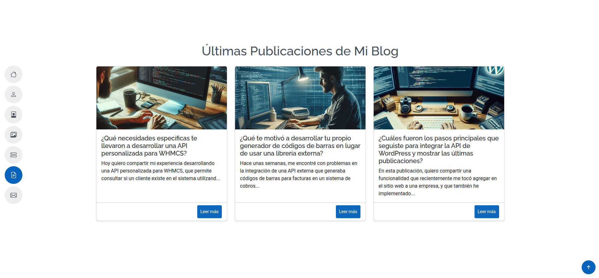

# 📬 Integración de la API de WordPress en Laravel para mostrar publicaciones del blog

En este proyecto se explica cómo consumir la API REST de WordPress desde una aplicación en Laravel para mostrar dinámicamente las últimas publicaciones de un blog en tu sitio web o portafolio.

Este tipo de integración es ideal para mantener tu sitio actualizado automáticamente con tus artículos más recientes, lo cual puede aportar valor a tu perfil profesional.

---

## 🚀 Funcionalidad

- Consulta la API de WordPress para obtener las últimas publicaciones (`wp-json/wp/v2/posts`).
- Extrae información básica como título, extracto, enlace y la imagen destacada.
- Muestra los posts en una grilla responsive usando Blade y Bootstrap.
- Fallback con imagen por defecto si no hay imagen destacada.

---

## 🧩 Tecnologías utilizadas

- **Laravel (PHP)**: Framework backend.
- **cURL**: Para realizar peticiones HTTP a la API de WordPress.
- **Blade**: Motor de plantillas para renderizar los datos.
- **Bootstrap 5**: Para el diseño de las tarjetas y el layout responsivo.

---

---

## 📸 Captura de Pantalla



---


## 📂 Estructura de Código

```text
app/
├── Http/
│   └── Controllers/
│       └── BlogController.php  ← Función getBlogPosts + makeCurlRequest

resources/
└── views/
    └── index.blade.php         ← Vista donde se muestran los posts

routes/
└── web.php                     ← Ruta para mostrar los posts (ej: /blog)
```


🔧 Código Principal
Obtener publicaciones:
```
├── Http/
│   └── Controllers/
│       └── BlogController.php  ← Función getBlogPosts + makeCurlRequest
```


## 📸 Vista Blade (index.blade.php)

```
resources/
└── views/
    └── index.blade.php 
    
```

## 📌 Consideraciones
- Reemplazá [URL_DE_TU_BLOG] por la URL real.

- Si el blog no tiene imágenes destacadas, se mostrará una imagen por defecto.

- Podés modificar el parámetro per_page para mostrar más publicaciones.

## 🧠 Autor
- Este ejemplo fue desarrollado por Sergio Rios, como parte de un proyecto para un cliente y también fue integrado en su propio sitio personal.

## 📄 Licencia
- Este código es de uso libre con fines educativos o personales. Si lo reutilizás, se agradece una mención 😉.